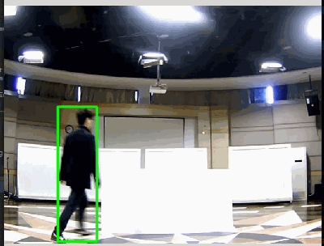
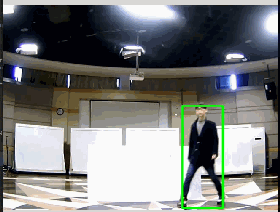

# Background Tracker

A tracker using background method for ARM's AI competition. See "技术报告.pdf" for more algorithmic details.

## Environment
* GCC
* CMake
* Opencv 2

## Effect
* normal scene （一般场景）

* occlusion scene （遮挡/下蹲）

## How to Use
In order to use video file (or use camera), please revise "#define USE_VIDEO_FILE" in "main_demo.cpp"

修改main_demo.cpp中的宏定义:"#define USE_VIDEO_FILE" 可以控制使用摄像头还是读取视频文件。

